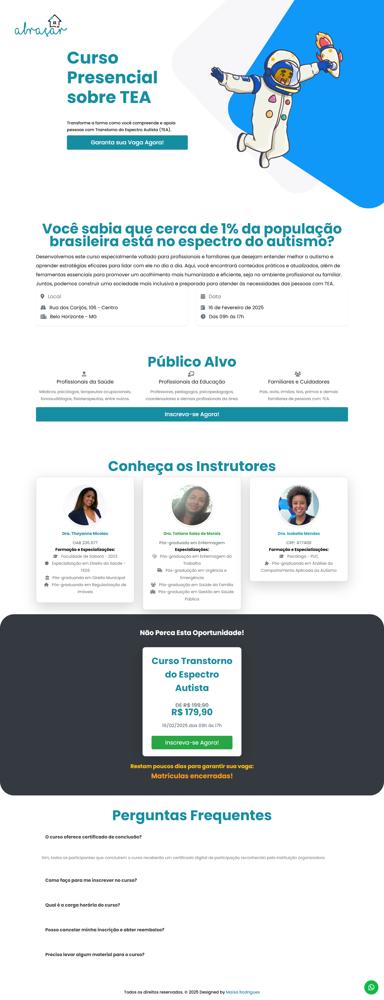

# Curso TEA - Abraçar Soluções 🧩💙

  

Este repositório contém o código-fonte da landing page do **Curso de TEA (Transtorno do Espectro Autista)**, desenvolvido para a **Abraçar Soluções**. O projeto foi estruturado para apresentar o conteúdo programático, os benefícios da especialização e facilitar o processo de inscrição para profissionais e familiares.

## 🎯 Objetivo do Projeto
O foco foi criar uma interface que transmita credibilidade, clareza e acolhimento. Como o tema envolve saúde e educação, a arquitetura de informação foi planejada para que os usuários encontrem rapidamente os módulos do curso, a metodologia aplicada e os canais de suporte.

## 🚀 Tecnologias e Implementações
- **Frontend:** HTML5, CSS3 e JavaScript.
- **UI/UX Acolhedor:** Uso de uma paleta de cores e elementos visuais que promovem tranquilidade e foco, adequados ao tema do autismo.
- **Arquitetura de Conversão:** Estrutura de página única (Landing Page) com chamadas para ação (CTAs) estratégicas para inscrição e contato.
- **Responsividade:** Otimizado para garantir que pais e profissionais possam acessar o conteúdo facilmente de qualquer dispositivo.

## 📂 Funcionalidades
- **Ementa do Curso:** Detalhamento dos módulos e tópicos abordados.
- **Seção "Sobre a Instituição":** Apresentação da autoridade e propósito da Abraçar Soluções.
- **Fluxo de Inscrição:** Integração para facilitar a jornada do aluno interessado.
- **FAQ e Suporte:** Seção de dúvidas frequentes para reduzir objeções e aumentar a confiança.

## 🌐 Link do Projeto
Veja a plataforma online: [amaple28.github.io/curso_tea_abracar_solucoes/](https://amaple28.github.io/curso_tea_abracar_solucoes/)

---
Desenvolvido por **Maisa Rodrigues**
